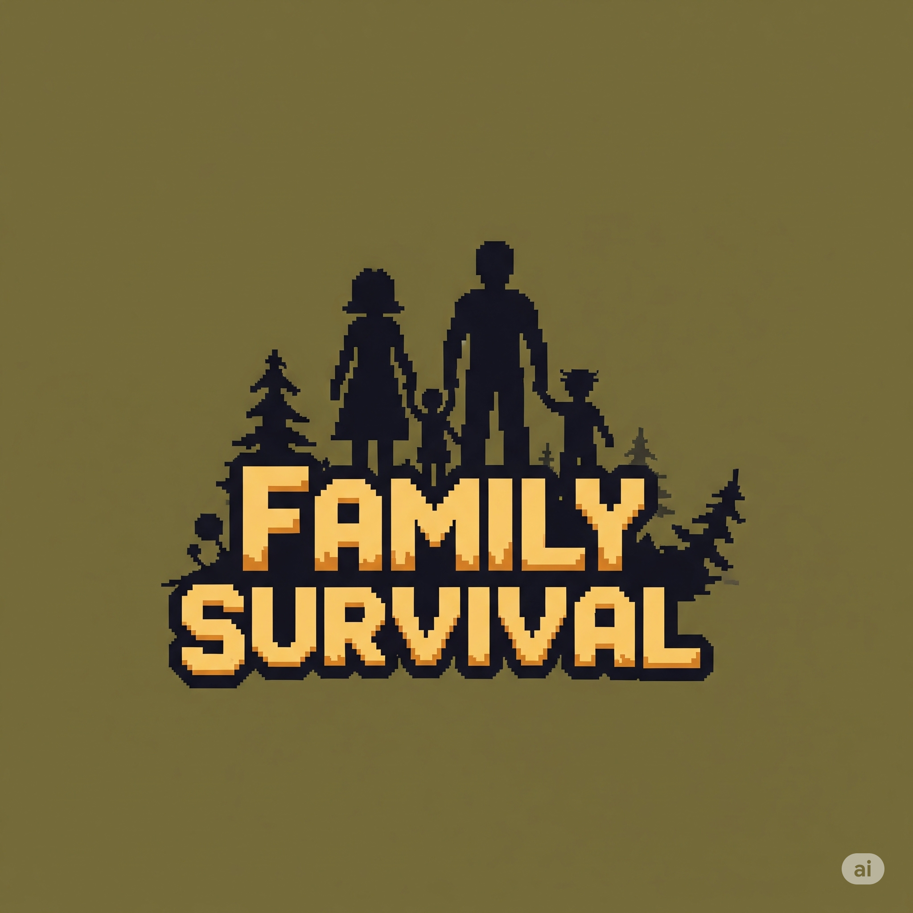

# Family-Survival

<div align="center">
  
</div>

## 📖 About The Project

Family-Survival is an action-packed survival game built with Unity. Players must survive waves of enemies while collecting resources, upgrading abilities, and protecting their family. The game features dynamic combat, character progression, and various survival mechanics.

## ✨ Features

### 🎮 Core Gameplay
- **Survival Combat**: Fight against waves of monsters with different AI behaviors
- **Character Progression**: Level up your character and unlock new abilities
- **Resource Collection**: Gather coins, gems, and other collectibles
- **Ability System**: Unlock and upgrade various abilities including:
  - Melee abilities
  - Projectile weapons
  - Boomerang attacks
  - Healing abilities
  - Throwable weapons
  - Proximity abilities

### 🏆 Game Systems
- **Dynamic Enemy AI**: Different monster types with unique behaviors
  - Melee monsters
  - Ranged attackers
  - Boomerang throwers
  - Boss encounters
- **Loot System**: Chests with randomized rewards
- **Localization**: Multi-language support
- **UI System**: Intuitive user interface with character cards and dialog boxes

### 🎨 Visual Features
- **Particle Effects**: Dynamic visual effects for combat and interactions
- **Custom Shaders**: Dissolve effects and infinite tile patterns
- **Sprite Animations**: Smooth character and enemy animations
- **Material System**: Custom materials for various game elements

## 🚀 Getting Started

### Prerequisites
- Unity 2021.3 LTS or later
- Git for version control
- Windows/Mac/Linux development environment

### Installation

1. **Clone the repository**
   ```bash
   git clone https://github.com/LTPPPP/Family-Survival.git
   cd Family-Survival
   ```

2. **Open in Unity**
   - Open Unity Hub
   - Click "Open"
   - Select the project folder
   - Wait for Unity to import all assets

3. **Scene Setup**
   - Navigate to `Assets/Scenes/Game/`
   - Open `Main Menu.unity` for the main menu
   - Open `Level 1.unity` for gameplay

### 🎮 How to Play

1. **Start the Game**: Launch from the Main Menu scene
2. **Movement**: Use WASD or arrow keys to move your character
3. **Combat**: Abilities auto-attack nearby enemies
4. **Collect Resources**: Pick up coins, gems, and items dropped by enemies
5. **Upgrade**: Use collected resources to upgrade your abilities
6. **Survive**: Last as long as possible against increasingly difficult waves

## 🏗️ Project Structure

```
Assets/
├── Blueprints/          # ScriptableObject blueprints for game entities
├── Prefabs/             # Pre-configured game objects
│   ├── Abilities/       # Player abilities and upgrades
│   ├── Monsters/        # Enemy prefabs and AI
│   ├── Projectiles/     # Weapons and projectiles
│   └── UI/              # User interface elements
├── Scripts/             # C# game logic
│   ├── Character/       # Player character systems
│   ├── Monsters/        # Enemy AI and behaviors
│   ├── Collectables/    # Items and resources
│   ├── Gameplay/        # Core game mechanics
│   └── UI/              # User interface logic
├── Sprites/             # 2D artwork and animations
├── Scenes/              # Unity scenes
└── Localization/        # Multi-language support
```

## 🛠️ Key Components

### Character System
- **Character Controller**: Handles player movement and input
- **Ability Manager**: Manages player abilities and upgrades
- **Level System**: Character progression and experience

### Combat System
- **Damage System**: Handles damage calculation and effects
- **Projectile System**: Various weapon types and behaviors
- **Monster AI**: Different enemy behaviors and attack patterns

### Resource System
- **Collectables**: Coins, gems, and power-ups
- **Chest System**: Loot containers with random rewards
- **Upgrade System**: Character and ability improvements

## 🎯 Development Roadmap

- [ ] Mobile platform support
- [ ] Additional character classes
- [ ] Boss battle improvements
- [ ] Multiplayer co-op mode
- [ ] Achievement system
- [ ] Save/load system
- [ ] Settings menu enhancements

## 🤝 Contributing

1. Fork the Project
2. Create your Feature Branch (`git checkout -b feature/AmazingFeature`)
3. Commit your Changes (`git commit -m 'Add some AmazingFeature'`)
4. Push to the Branch (`git push origin feature/AmazingFeature`)
5. Open a Pull Request

### Code Style
- Follow Unity C# naming conventions
- Use meaningful variable and method names
- Comment complex logic
- Keep methods focused and small

## 📝 License

This project is licensed under the MIT License - see the [LICENSE](LICENSE) file for details.

## 🎖️ Credits

### Development Team
- **Project Lead**: LTPPPP
- **Programming**: LTPPPP
- **Game Design**: LTPPPP, Gemini, ChatGPT, Stable Diffusion,...
### Assets & Resources
- **Sprites**: Kenney.nl (UI elements)
- **Fonts**: Noto Sans Mono CJK
- **Unity Packages**: 
  - TextMeshPro
  - Addressables
  - Localization
  - Adaptive Performance

## 📞 Contact

Project Link: [https://github.com/LTPPPP/Family-Survival](https://github.com/LTPPPP/Family-Survival)

---

<div align="center">
  <p>Made with LTPPPP using Unity</p>
</div> 